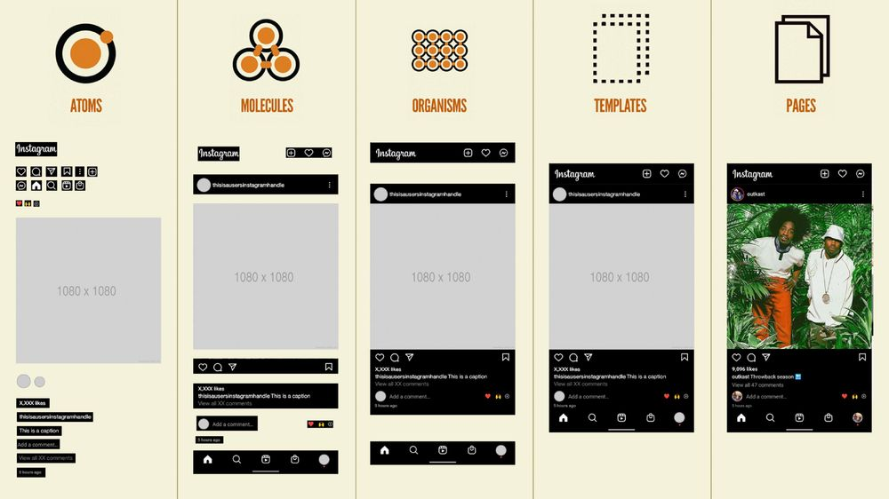

Que es atomic design ?

Atomic Design es una metodología para crear interfaces modulares, ordenadas y reutilizables, componiendo desde piezas pequeñas (átomos) hasta pantallas completas (páginas).

¿Por qué existe Atomic Design?

Se repetía mucho código.
Los diseñadores hacían pantallas inconsistentes.
Era difícil mantener componentes grandes.
Era difícil escalar proyectos UI.

| **Nivel**      | **Descripción**                                               | **Ejemplo**                                               |
|----------------|---------------------------------------------------------------|-----------------------------------------------------------|
| **Átomos**     | Elementos mínimos y básicos de la interfaz.                   | Botón, Input, Label, Icono.                               |
| **Moléculas**  | Conjunto de átomos que funcionan como una unidad.             | Campo de formulario: Label + Input + Mensaje de error.    |
| **Organismos** | Secciones completas formadas por moléculas y/o átomos.        | Header, Navbar, Tarjeta de producto, Footer.              |
| **Templates**  | Estructura de la página sin contenido final (layout).         | Distribución de secciones sin datos reales.               |
| **Pages**      | Página final con contenido real o datos dinámicos.            | Página de Login, Perfil de Usuario, Dashboard.            |
