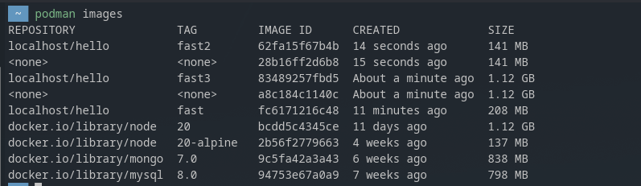
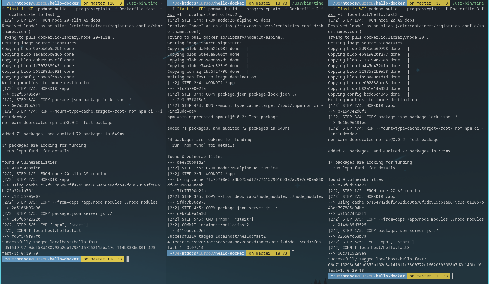
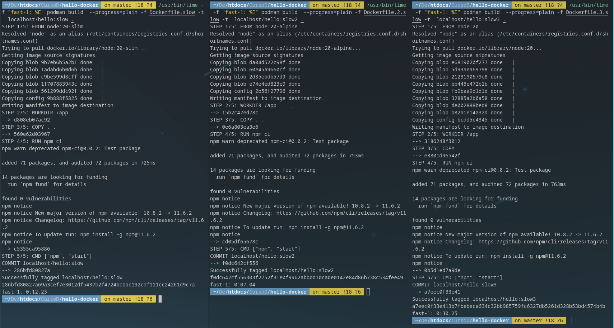

Recomendaciones para un dockerfile mas optimo y rapido:

Capas (Layer Caching):

    Copia solo package.json y package-lock.json primero.

    Ejecuta npm ci para instalar dependencias.

    Finalmente, copia el resto del código (COPY . .).

    Objetivo: Asegurar que la costosa instalación de dependencias solo se ejecute si los archivos de bloqueo cambian.

    
Multi-stage Builds:

    Divide el Dockerfile en etapas: deps (dependencias) → build (compilación) → runtime (imagen final).

    Objetivo: Reducir drásticamente el tamaño de la imagen final al excluir herramientas de desarrollo y archivos intermedios.

    
BuildKit + Caché de Montaje:

    Activa BuildKit con DOCKER_BUILDKIT=1.

    Usa --mount=type=cache,target=/root/.npm (o similar) en el comando RUN npm ci.

    Objetivo: Evitar que npm descargue dependencias desde internet en cada build, acelerando la instalación.

    
.dockerignore:

    Excluye directorios y archivos innecesarios del contexto de build.

    Incluye: node_modules/, dist/, .git/, logs, etc.

    Objetivo: Minimizar el tamaño del contexto copiado inicialmente y evitar archivos basura en la imagen.

Paso 1: Depurar cache

```docker
podman builder prune -af
```

Paso 2: Desde cero fast es mejor

```docker
/usr/bin/time -f "slow-1: %E" podman build --progress=plain -f Dockerfile.slow -t localhost/hello:slow .

/usr/bin/time -f "fast-1: %E" podman build  --progress=plain -f Dockerfile.fast -t  localhost/hello:fast .
```

Paso 3: Con cambios fast es mejor
```
echo "// cambio" >> server.js
```

```docker
/usr/bin/time -f "slow-1: %E" podman build --progress=plain -f Dockerfile.slow -t localhost/hello:slow .

/usr/bin/time -f "fast-1: %E" podman build  --progress=plain -f Dockerfile.fast -t  localhost/hello:fast .
```

Paso 4: Sin cambios la diferencia es minima siendo asi slow mejor que fast

```docker
/usr/bin/time -f "slow-1: %E" podman build --progress=plain -f Dockerfile.slow -t localhost/hello:slow .

/usr/bin/time -f "fast-1: %E" podman build  --progress=plain -f Dockerfile.fast -t  localhost/hello:fast .
```

#### export BUILDAH_LAYERS=1

Resultado aproximados (node:20-slim):

```docker
Caso                 slow        fast
-----------------------------------------
Cold start           11.95 s     1.80 s   ← gran mejora (deps cacheadas + menos I/O)
Cambio solo código   1.84 s      0.40 s   ← reuse de deps en fast
Sin cambios          0.18 s      0.50 s   ← mas pasos en fast
```
Sin cambios se percibe que en slow es mejor ya que en fast existe mas pasos no obstante solo pasa cuando no existe cambios sin embargo no debemos volver a ejecutar si no tiene nada que alterar.

Con base a la imagen estos tiempos pueden aumentar o disminuir...

Paso 5: Subir imagen

```docker
podman run --rm -p 3000:3000 localhost/hello:fast

podman run --rm -p 3000:3000 localhost/hello:slow
```

Busqueda de imagen en internet o local

```docker
--pull=missing
--pull=never
--pull=always
```

No usar cache

```docker
--no-cache
```
Las imagenes influyen tambien en el tiempo de ejecucion y optimizacion:

    fast3 -> node:20 -> 1.12 GB
    fast -> node:20-slim -> 208 MB
    fast2 -> node:20-alpine -> 141 MB

La imagen final de fast2 tiene un peso de 141 MB mientras que fast3 en los peores casos 1.12 GB



A la hora de hacer build, con base a esto vemos que tambien existe una mejora significativa segun la imagen

    fast3 -> node:20 -> 0:29.18
    fast -> node:20-slim -> 0:10.79
    fast2 -> node:20-alpine -> 0:07.14



    slow3 -> node:20 -> 0:30.25
    slow -> node:20-slim -> 0:12.23
    slow2 -> node:20-alpine -> 0:07.04



En lo anterior solo se esta mostrando que las imagenes tambien afectan el tiempo del build

Paso 6: Probar
# En otra terminal:
```
curl -s http://localhost:3000/
```