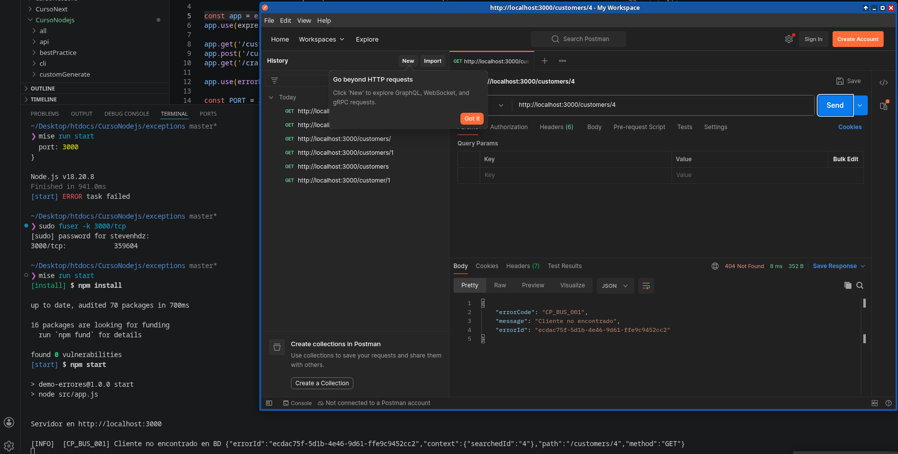
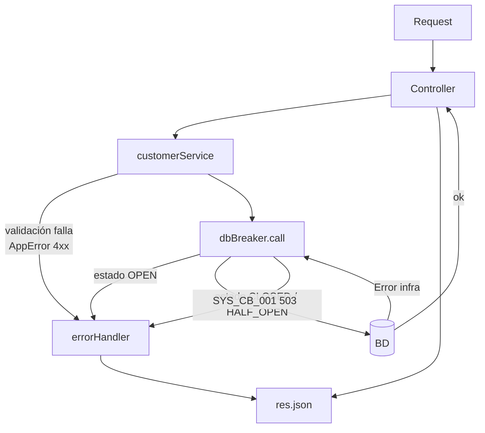

Soporte resuelve solo — busca el código en el catálogo, no escala al dev.
Encuentras el error exacto en logs — el errorId único te lleva al evento en segundos.
No filtras detalles internos — el usuario ve CP_VAL_001, no nombres de tablas ni stack traces.
Métricas reales — puedes contar y alertar por código (ej: "PAY_INF_001 subió 10x").
Logs limpios — cada código define su nivel, no se llena el disco con ruido.
Cambios en un solo lugar — mensajes y comportamiento centralizados.
Internacionalización fácil — el código no cambia, solo traduces el mensaje.
Frontend reacciona al código — if errorCode === 'AUTH_BUS_001' → redirigir login.
Tests robustos — comparas códigos, no strings frágiles.
Documentación viva — el catálogo explica qué puede fallar en la app.

