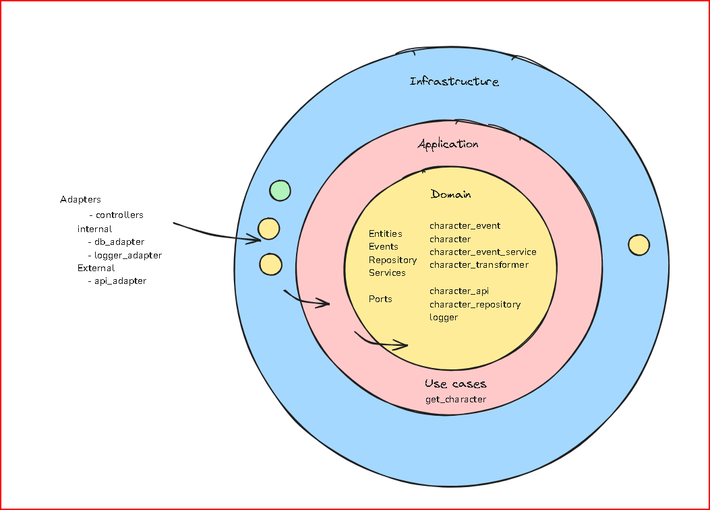

project/
│
├── app.py
│
├── application/
│   └── use_cases/
│       └── get_character.py
│
├── domain/
│   ├── models/
│   │   └── character.py
│   ├── ports/
│   │   ├── character_api.py
│   │   ├── character_repository.py
│   │   └── logger.py
│   ├── events/
│   │   └── character_event.py
│   └── services/
│       └── character_service.py
│
├── infrastructure/
│   ├── external_adapters/
│   │   └── api_adapter.py
│   │
│   ├── internal_adapters/
│   │   ├── db_adapter.py
│   │   ├── logger_adapter.py
│   │
│   ├── controllers/
│   │   └── character_controller.py
│

```sh {"id":"01JCBASYB48KWDPATJZJ02N0PY"}
Scripts\activate
python app.py
pytest tests
```

Resumen de Interacción entre Capas
La capa de dominio define la lógica del negocio y no conoce los detalles de infraestructura.
La capa de aplicación coordina los casos de uso, manteniendo el flujo de datos y asegurando que las reglas de negocio se apliquen correctamente.
La capa de infraestructura implementa los puertos definidos en el dominio, conectando el sistema con servicios externos o recursos internos necesarios para que la aplicación funcione.

