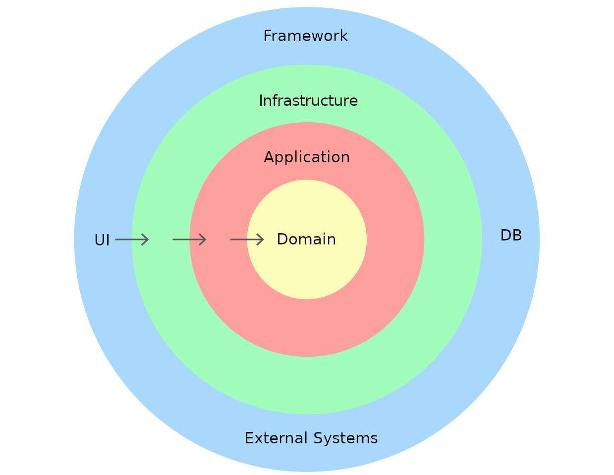

# Flask + Vertical Slice + Shared Kernel + Memberships (User joins Product)

Proyecto de ejemplo con **Vertical Slice Architecture** y **Shared Kernel**.
Incluye 3 slices: `users`, `products`, `memberships` y un **Shared Kernel** con IDs compartidos.

- **Shared Kernel** (`src/shared/ids.py`): `UserId`, `ProductId`.
- **Users**: crear y obtener usuarios (con `Email` VO local).
- **Products**: crear, obtener y actualizar precio.
- **Memberships**: relación usuario ↔ producto (join, listar por usuario). Mantiene las invariantes de la relación.

## Estructura
```
flask_vslice_users_products_memberships_shared/
├─ README.md
├─ requirements.txt
├─ run.py
└─ src/
   ├─ api/
   │  └─ flask_app.py
   ├─ shared/
   │  └─ ids.py
   └─ features/
      ├─ users/
      │  ├─ application/{dtos,ports,use_cases}.py
      │  ├─ domain/{entities,errors,value_objects}.py
      │  └─ infrastructure/{controllers,repositories}.py
      ├─ products/
      │  ├─ application/{dtos,ports,use_cases}.py
      │  ├─ domain/{entities,errors,value_objects}.py
      │  └─ infrastructure/{controllers,repositories}.py
      └─ memberships/
         ├─ application/{ports,use_cases}.py
         ├─ domain/entities.py
         └─ infrastructure/{controllers,readers,repositories}.py
```



## Endpoints
### Users
- `POST /users` → `{ "name": "Ana", "email": "ana@mail.com" }`
- `GET  /users/<user_id>`

### Products
- `POST /products` → `{ "name": "Teclado", "price": 99.9, "stock": 10 }`
- `GET  /products/<product_id>`
- `POST /products/<product_id>/price` → `{ "price": 120.0 }`

### Memberships (User ↔ Product)
- `POST /memberships/join` → `{ "user_id": "...", "product_id": "..." }`
- `GET  /memberships/user/<user_id>`

## Ejecutar
```bash
python -m venv .venv
# Linux/Mac
source .venv/bin/activate
# Windows
# .venv\Scripts\activate

pip install -r requirements.txt
python run.py   # http://127.0.0.1:8000
```
