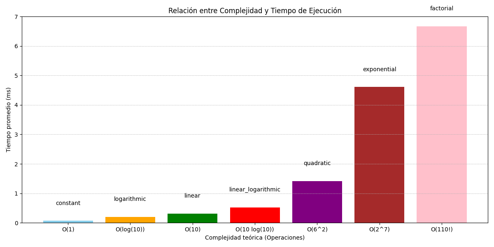
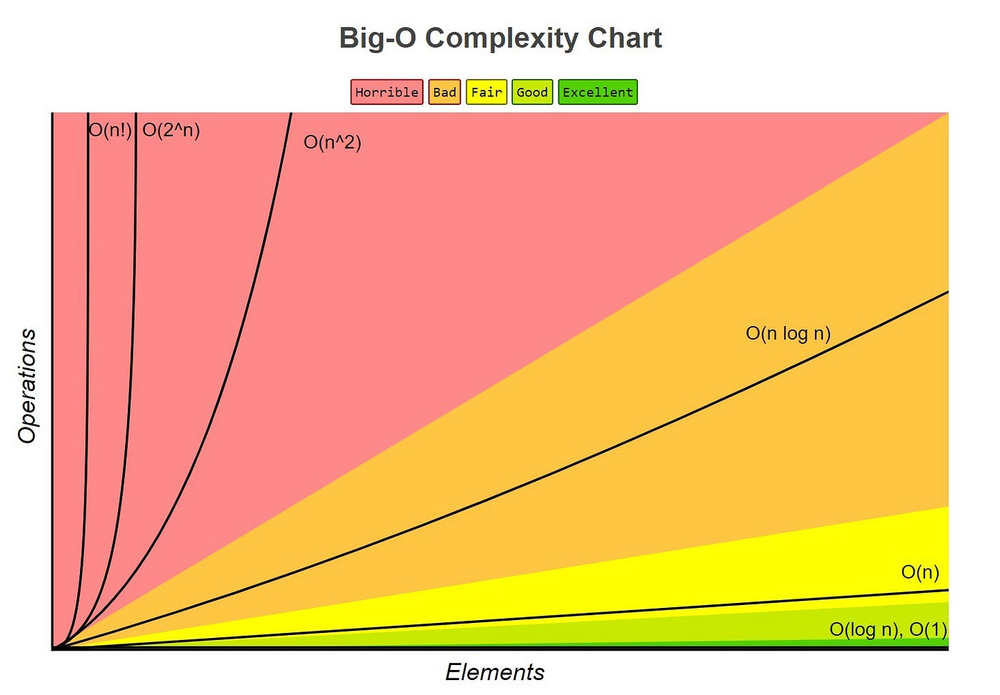

# Notación Big O

## 1. Definición

**Big O** es una notación matemática que describe el límite superior del tiempo de ejecución o el uso de espacio de un algoritmo. Se denota como **O(f(n))**, donde **f(n)** es una función que representa el tiempo o espacio en función del tamaño de la entrada **n**.

## 2. Propósito

- **Comparación de Algoritmos**: Permite comparar diferentes algoritmos y elegir el más eficiente para un problema dado.
- **Escalabilidad**: Ayuda a predecir cómo se comportará un algoritmo cuando la cantidad de datos aumenta.

## 3. Clases Comunes de Complejidad

A continuación, se detallan las clases más comunes de complejidad temporal y espacial:

## 4. Análisis de Complejidad

- **Peor Caso**: Se refiere al escenario donde el algoritmo tarda más tiempo o usa más recursos. Big O generalmente se refiere a este caso.
- **Mejor Caso y Caso Promedio**: Aunque son importantes, se utilizan menos frecuentemente para la notación Big O.

## 5. Dominancia y Simplificación

Al comparar funciones de complejidad, se considera la parte dominante:

- *Ejemplo*: **O(n + n²)** se simplifica a **O(n²)** porque **n²** domina cuando **n** es grande.

## 6. Espacio vs. Tiempo

- **Complejidad Temporal**: Se refiere al tiempo que tarda un algoritmo en ejecutarse.
- **Complejidad Espacial**: Se refiere a la cantidad de memoria adicional que utiliza. Puede tener notaciones como **O(1)** (espacio constante) o **O(n)** (espacio lineal).

## 7. Ejemplos Prácticos

- **Búsqueda Lineal**: **O(n)**, porque revisa cada elemento.
- **Búsqueda Binaria**: **O(log n)**, divide la lista a la mitad en cada paso.
- **Ordenación por Burbuja**: **O(n²)**, porque para cada elemento compara con todos los demás.

## 8. Uso en la Práctica

Al diseñar un algoritmo, se busca que tenga la menor complejidad posible. Por ejemplo, en aplicaciones donde se manejan grandes volúmenes de datos, un algoritmo **O(n log n)** es preferible a uno **O(n²)**.

## 9. Limitaciones

- Big O no proporciona información sobre la constante oculta o el tiempo real de ejecución.
- Dos algoritmos pueden tener la misma complejidad Big O pero rendir de manera diferente en la práctica.