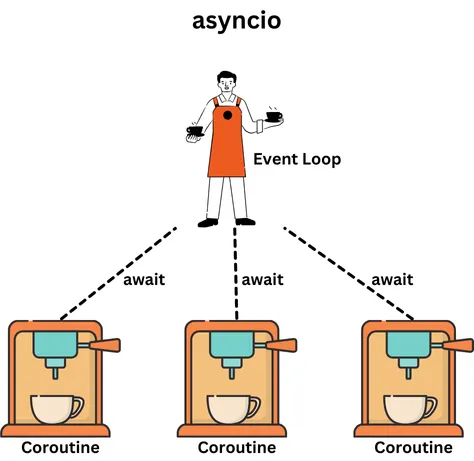
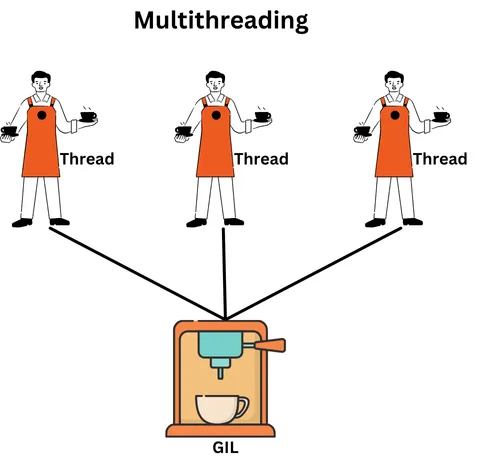
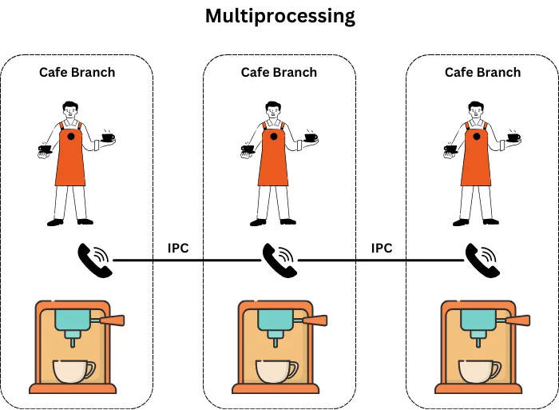

# Resumen de Uso de Recursos

## Uso de RAM:

- **Asyncio**: Bajo
- **Multiprocessing**: Alto
- **Threading**: Moderado

## Uso de CPU:

- **Asyncio**: Bajo o Moderado
- **Multiprocessing**: Alto
- **Threading**: Moderado

## Tipo de Concurrencia:

- **Asyncio**: Utiliza un solo hilo para manejar múltiples tareas concurrentes mediante corutinas.
- **Multiprocessing**: Utiliza múltiples procesos para ejecutar tareas concurrentes.
- **Threading**: Utiliza un hilo por cada tarea concurrente.

## Aprovechamiento del Potencial de la CPU:

- **Multiprocessing**: Aprovecha todo el potencial de la CPU para tareas CPU-bound.
- **Asyncio**: No maximiza el uso de la CPU para tareas CPU-bound, operando en un solo hilo.
- **Threading**: Limitado por el GIL, no puede utilizar completamente los recursos de la CPU para tareas CPU-bound.

## Velocidad:

- **Asyncio**: Generalmente rápido para tareas IO-bound, ya que permite una alta concurrencia sin crear múltiples hilos o procesos.
- **Multiprocessing**: Rápido para tareas CPU-bound, especialmente si se ejecutan en múltiples núcleos, aunque la sobrecarga de creación de procesos puede ser un factor.
- **Threading**: Rápido para tareas IO-bound, pero limitado en tareas CPU-bound debido al GIL, lo que puede resultar en un rendimiento inferior en comparación con `multiprocessing`.

https://medium.com/@kunalsawhney/asyncio-vs-multithreading-vs-multiprocessing-in-python-the-epic-battle-for-efficient-performance-78c2fd653ee0