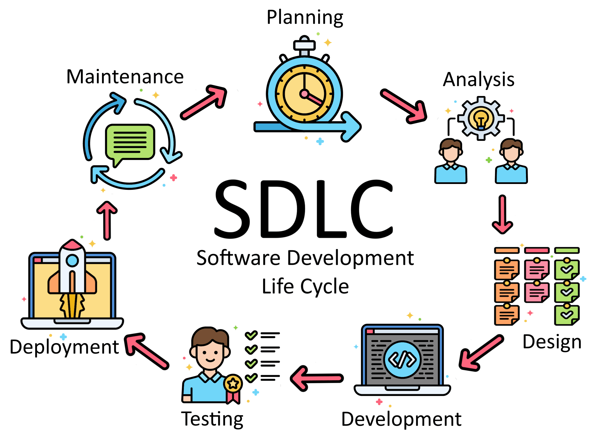
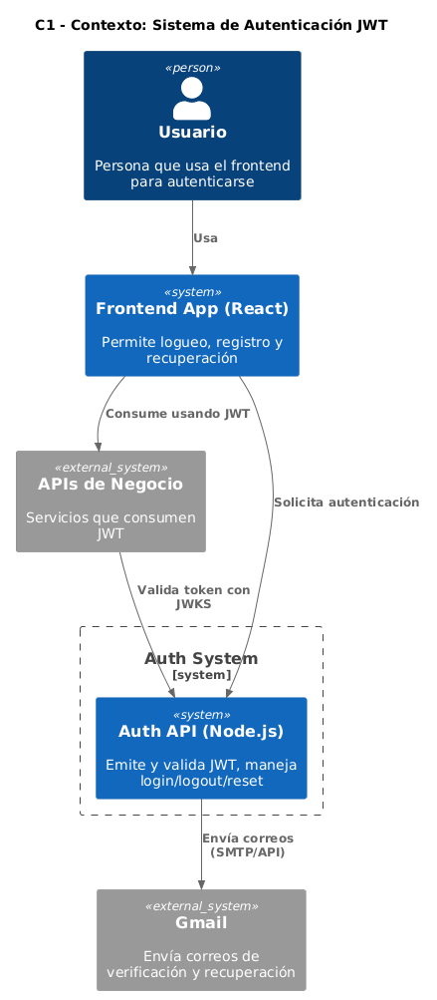
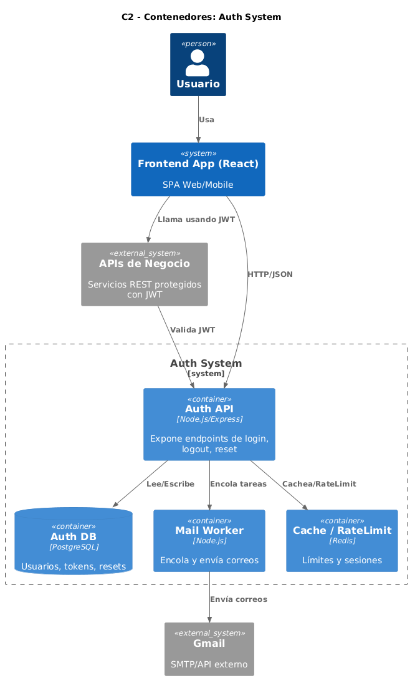
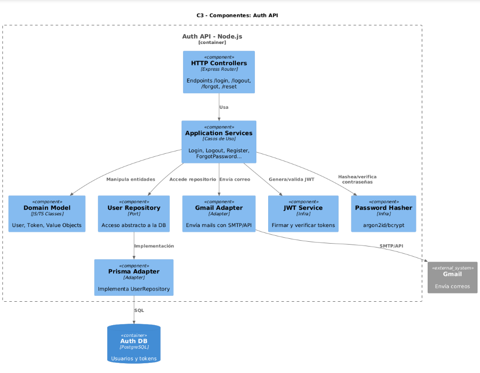
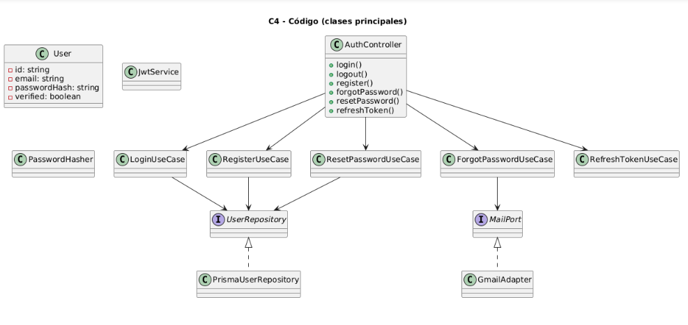

# SDLC

[](image-4.png)

> 📌 El **modelo C4** se aplica **entre la fase de Diseño y Desarrollo**.  
Sirve como puente entre **arquitectura de alto nivel** y **implementación de código**.

---

# 🔄 SDLC (Software Development Life Cycle) — Esquema Completo

## 1️⃣ Planeación
- Definir problema y objetivos del proyecto.  
- Identificar stakeholders y usuarios finales.  
- Delimitar el alcance (MVP vs futuro).  
- Estimar costos, tiempos, recursos y riesgos.  

📄 **Entregables:**
- Documento de visión / alcance.  
- Cronograma inicial (ej: Gantt, roadmap).  
- Matriz de riesgos.  

---

## 2️⃣ Análisis de requisitos
- Requisitos **funcionales**: qué debe hacer el sistema.  
- Requisitos **no funcionales**: seguridad, rendimiento, disponibilidad, escalabilidad.  
- Casos de uso y escenarios alternos.  
- Priorización de requisitos (MoSCoW, Kano, WSJF).  

📄 **Entregables:**
- Documento SRS (Software Requirement Specification).  
- Diagramas de casos de uso.  
- Historias de usuario con criterios de aceptación.  

---

## 3️⃣ Diseño del sistema 🟢
Definir **cómo se construirá la solución**.

### a) **Arquitectura**
- Uso del **modelo C4**:  
  - **C1 (Contexto):** usuarios y sistemas externos.  
  - **C2 (Contenedores):** apps, APIs, BD, front/back.  
  - **C3 (Componentes):** módulos internos de cada contenedor.  
  - **C4 (Código):** clases, librerías, funciones.  
- **ADRs**: decisiones de diseño técnico (ej: JWT para autenticación, PostgreSQL como BD).  

### b) **Base de datos**
- Modelo conceptual (ERD).  
- Modelo lógico (tablas y relaciones).  
- Modelo físico (índices, tipos de datos, normalización).  

### c) **UX/UI**
- Personas y journeys.  
- Wireframes → Mockups → Prototipo navegable (ej: Figma).  

📄 **Entregables:**
- Documento de diseño de arquitectura (C4 + ADRs).  
- Diagramas de BD.  
- Prototipos UX/UI.  

---

## 4️⃣ Desarrollo (Coding)
- Implementación de frontend.  
- Implementación de backend (APIs, lógica de negocio).  
- Integración con base de datos y servicios externos.  
- Buenas prácticas (SOLID, DRY, KISS, GRASP).  
- Git + pipelines CI/CD.  

📄 **Entregables:**
- Código en repositorio.  
- Documentación técnica (endpoints, módulos y servicios).  

---

## 5️⃣ Pruebas (Testing)
- **Unitarias, Integración, Funcionales, UI/UX, Seguridad, Performance.**  

📄 **Entregables:**
- Casos de prueba.  
- Reportes de ejecución.  
- Métricas de calidad (cobertura de tests).  

---

## 6️⃣ Despliegue (Deployment)
- Configuración de ambiente productivo.  
- CI/CD + monitoreo, logging y alertas.  
- Estrategias: canary, blue-green, rolling.  

📄 **Entregables:**
- Manual de despliegue.  
- Sistema en producción.  
- Panel de monitoreo (ej: Grafana, ELK).  

---

## 7️⃣ Mantenimiento
- Corrección de errores, parches y mejoras.  
- Optimización continua.  
- Documentación y diagramas actualizados.  

📄 **Entregables:**
- Changelog.  
- Documentación actualizada.  
- Backlog de mejoras.  

---

# 🔐 Especificación de Requisitos — App de Autenticación

## ✅ Requisitos Funcionales
1. Registro con correo y contraseña.  
2. Inicio de sesión con credenciales válidas.  
3. Recuperación de contraseña vía correo.  
4. Cierre de sesión seguro.  

## ⚙️ Requisitos No Funcionales
1. Login en < 2 segundos.  
2. Contraseñas con **bcrypt**.  
3. Disponibilidad 99.5% mensual.  
4. Bloqueo tras 5 intentos fallidos.  

## 🎯 Caso de Uso: Iniciar Sesión

**Actor principal:** Usuario registrado  

**Flujo principal:**
1. Usuario abre la app → “Iniciar sesión”.  
2. Ingresa correo y contraseña.  
3. Backend valida credenciales.  
4. ✅ Correcto → acceso al perfil.  
5. ❌ Incorrecto → mensaje de error.  

**Flujo alterno:**  
- “¿Olvidaste tu contraseña?” → correo con enlace de restablecimiento.  

---

# MODULO C4 - ARQUITECTURA SOFTWARE

| C1 - Contexto | C2 - Contenedores |
|---------------|------------------|
| [](image.png) | [](image-1.png) |

| C3 - Componentes | C4 - Código |
|------------------|-------------|
| [](image-2.png) | [](image-3.png) |

🔗 **PlantUML:** https://editor.plantuml.com/

---

# 📌 Objetivos del Modelo C4

| Nivel | Objetivo | Enfocado en | Pregunta que responde |
|-------|-----------|-------------|------------------------|
| **C1 — Contexto** | Mostrar el sistema en su panorama más amplio, incluyendo usuarios y externos. | Stakeholders, directivos. | *¿Qué es el sistema y con quién se comunica?* |
| **C2 — Contenedores** | Mostrar las piezas tecnológicas principales (web, API, BD, colas). | Arquitectos y devs. | *¿De qué está hecho el sistema?* |
| **C3 — Componentes** | Organización interna de cada contenedor (controladores, servicios, repos). | Dev teams. | *¿Cómo se organizan los módulos internos?* |
| **C4 — Código** | Nivel de clases, interfaces, métodos. | Desarrolladores. | *¿Cómo se implementa en código?* |

---

# 📂 Relación C3/C4 con estructura de carpetas

```code
src/
├─ controllers/
│  └─ auth.controller.ts              
├─ application/
│  ├─ login.usecase.ts
│  ├─ logout.usecase.ts
│  └─ ...
├─ domain/
│  ├─ user.entity.ts                  
│  ├─ token.entity.ts                 
│  └─ policies.ts                     
├─ ports/
│  ├─ user.repo.port.ts               
│  ├─ token.repo.port.ts              
│  └─ mail.port.ts                    
├─ adapters/
│  ├─ orm/ (repos)                    
│  ├─ mail/ (SMTP/Gmail API)          
│  └─ security/ (JWT, password hash)  
├─ middlewares/                       
├─ routes/                            
├─ shared/                            
└─ main.ts                            
```

---

# ADR-001: Elección de JWT para Autenticación

## Contexto
Se requiere autenticación **stateless** para escalar y soportar clientes web/móvil.  

## Decisión
- Autenticación con **JWT**.  
- Algoritmo: **HS256** (posible migración a RS256).  
- Expiración: **15 min + refresh 7 días**.  
- Almacenamiento: memoria de sesión.  

## Consecuencias
- ✅ Escalabilidad sin mantener sesión en servidor.  
- ✅ Compatible con microservicios y APIs.  
- ⚠️ Revocación y expiración requieren manejo cuidadoso.  

link: https://github.com/npryce/adr-tools
