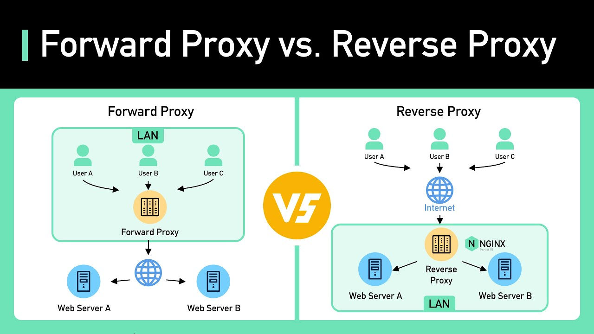
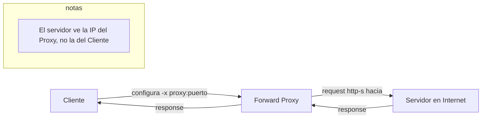
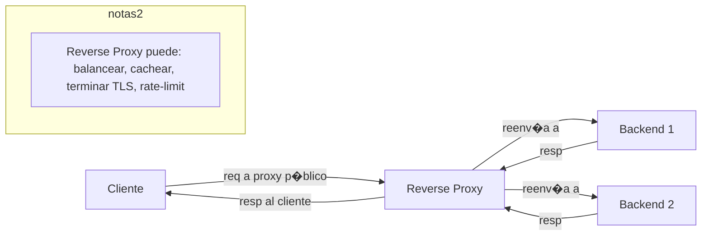
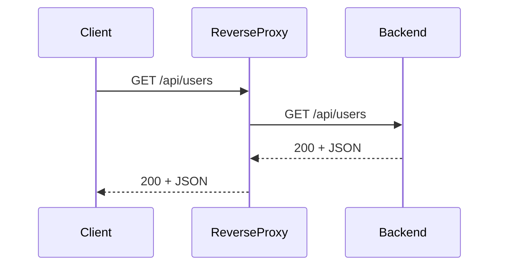
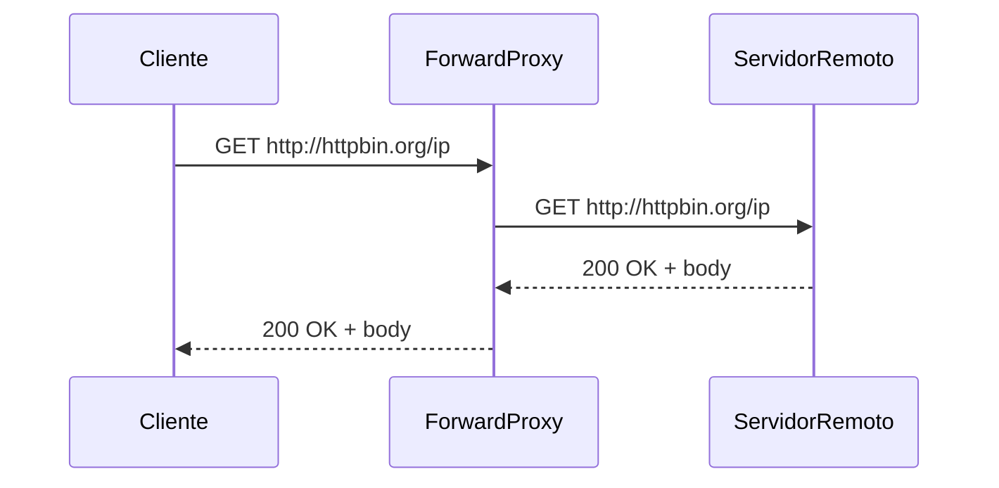

Resumen r�pido

Forward proxy (proxy directo): El cliente configura el proxy. El proxy sale a internet en nombre del cliente (oculta al cliente).

Reverse proxy (proxy inverso): El cliente env�a peticiones al proxy p�blico. El proxy distribuye/reenv�a a uno o varios backends internos (oculta/gestiona servidores, balancea, termina TLS, cachea).

Flow — Forward Proxy (cliente usa proxy para acceder a Internet)

Flow — Reverse Proxy (cliente golpea proxy público y este usa los backends)

Secuencia simplificada (Reverse Proxy)

Secuencia simplificada (Forward Proxy)

| Caso                                      | Usa Forward Proxy        | Usa Reverse Proxy |
|-------------------------------------------|--------------------------|-------------------|
| Controlar navegación de usuarios          | ✅                       | ❌                |
| Filtrar/registrar salidas a Internet      | ✅                       | ❌                |
| Anonimizar IP del cliente                 | ✅                       | ❌                |
| Balancear carga entre backends            | ❌                       | ✅                |
| Terminar TLS / certificado                | ❌                       | ✅                |
| Cache en el borde de la app               | ❌                       | ✅                |
| Inspección para debugging (mitm)          | ✅ (mitmproxy)           | ❌                |
