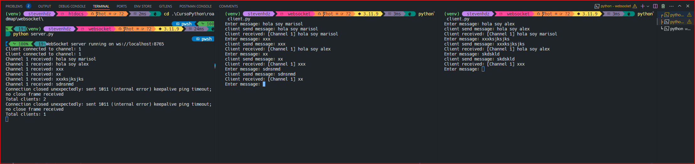

WebSocket vs Socket.IO: Resumen
Protocolo:

WebSocket: Protocolo estándar (RFC 6455).
Socket.IO: Librería que usa WebSocket y otros transportes.
Reconexión automática:

WebSocket: No soporta reconexión automática.
Socket.IO: Soporta reconexión automática.
Compatibilidad con navegadores:

WebSocket: Requiere soporte nativo de WebSocket en el navegador.
Socket.IO: Funciona incluso si WebSocket no está disponible (fallback a HTTP long polling).
Eventos:

WebSocket: No tiene gestión de eventos.
Socket.IO: Soporta eventos con nombre y manejo estructurado.
Escalabilidad:

WebSocket: Escalabilidad gestionada manualmente.
Socket.IO: Soporta escalabilidad multi-servidor con Redis.
Facilidad de uso:

WebSocket: Requiere manejo manual.
Socket.IO: Fácil de usar con abstracción y manejo de eventos.
Cuándo usar cada uno:
WebSocket:

Necesitas comunicación bidireccional eficiente en tiempo real.
Tienes control total sobre el protocolo.
No necesitas la funcionalidad extra de Socket.IO.
Socket.IO:

Necesitas reconexión automática, manejo de eventos, y soporte multi-servidor.
Buscas una solución más sencilla y robusta para aplicaciones en tiempo real.

Test:

