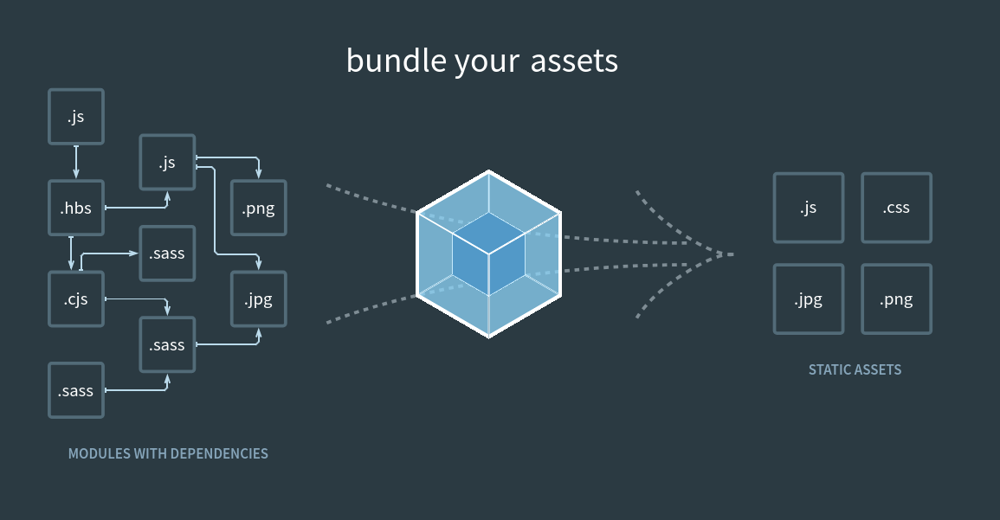

Que es webpack ?
- Webpack es un empaquetador (bundler) que toma los archivos fuente de tu proyecto (JavaScript, CSS, imágenes, HTML, etc.) desde la carpeta src/ y los transforma en archivos optimizados listos para producción dentro de la carpeta build/.

Su objetivo es:

- Unificar archivos y dependencias.
- Optimizar tamaño y desempeño.
- Permitir módulos modernos (import/export).
- Crear una versión lista para navegador con máxima compatibilidad.

Estructura típica

    src/                build/
    App.js              index.html
    index.js            main.[hash].js
    style.css           styles.[hash].css (prod)
    utils.js
    index.html

Entendimiento

    La carpeta src/ contiene el código fuente.
    La carpeta build/ es generada automáticamente por Webpack.

para temas de compatibilidad usar babel para transpilar JS/JSX de React

para configurar webpack.config.js

Documentacion:

https://webpack.js.org/blog/2020-10-10-webpack-5-release/