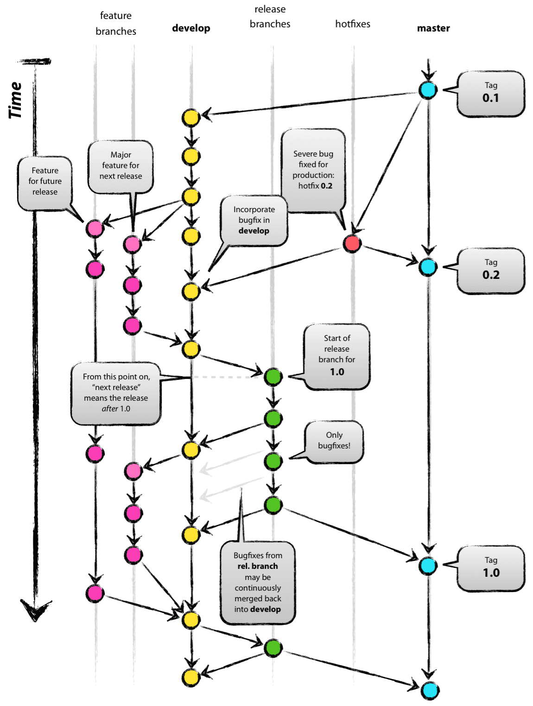

# Guía Completa de GitFlow

**GitFlow** es un flujo de trabajo para Git que ayuda a gestionar el ciclo de vida del desarrollo de software con una estructura clara de ramas, ideal para equipos que trabajan en múltiples versiones y características simultáneamente. A continuación, te explico cómo utilizar GitFlow, paso a paso, con ejemplos prácticos.

### Iniciar GitFlow
El primer paso es inicializar **GitFlow** en tu repositorio. Esto configura las ramas principales que se usarán en el flujo de trabajo, como `main` (o `master`) para producción y `develop` para desarrollo.

```bash
git flow init
```

Este comando establece las ramas `main` y `develop` por defecto. Si ya las tienes en tu repositorio, GitFlow las reconocerá automáticamente.

### Crear una nueva rama de característica (feature)
Cuando inicies el desarrollo de una nueva funcionalidad, debes crear una rama de característica a partir de `develop`. Esto asegura que el código en desarrollo no interfiera con la rama de producción.

```bash
git flow feature start login
```

Este comando crea una rama llamada `feature/login` a partir de `develop`, en la que trabajarás en la nueva funcionalidad de inicio de sesión. Una vez que hayas terminado de trabajar en la funcionalidad, debes finalizar la rama de característica.

### Finalizar la rama de característica
Cuando hayas terminado de desarrollar la nueva funcionalidad, debes finalizar la rama de característica y fusionarla nuevamente en `develop`.

```bash
git flow feature finish login
```

Este comando fusiona la rama `feature/login` en `develop` y elimina la rama `feature/login` localmente. Ahora, la nueva funcionalidad está disponible en `develop` para futuras integraciones.

### Crear una rama de liberación (release)
Cuando estés listo para preparar una nueva versión de tu aplicación, debes crear una rama de liberación. Esta rama se crea a partir de `develop` y se usa para realizar las pruebas finales y correcciones antes del lanzamiento.

```bash
git flow release start 1.0.0
```

Este comando crea una rama de liberación llamada `release/1.0.0`. Aquí es donde puedes hacer los últimos ajustes, correcciones y pruebas para la nueva versión.

### Finalizar la liberación y fusionarla en main
Cuando la versión esté lista para lanzarse, finalizas la rama de liberación y la fusionas en `main` (o `master`). Además, debes fusionarla de nuevo en `develop` para asegurar que los cambios estén disponibles para futuras versiones.

```bash
git flow release finish 1.0.0
```

Este comando fusiona la rama `release/1.0.0` en `main`, marca la versión con un tag (por ejemplo, `v1.0.0`), y luego fusiona los cambios en `develop`. Después, elimina la rama `release/1.0.0`.

### Crear una corrección de error (hotfix)
Cuando encuentres un error crítico en producción, puedes crear una rama de corrección de error (hotfix). Esta rama se crea a partir de `main` y se utiliza para arreglar el problema de inmediato.

```bash
git flow hotfix start hotfix-1.0.1
```

Este comando crea una rama `hotfix/hotfix-1.0.1` desde `main` para corregir el error. Aquí puedes realizar las correcciones necesarias rápidamente sin interferir con el desarrollo en `develop`.

### Finalizar la corrección de error
Cuando hayas solucionado el error en la rama `hotfix`, debes finalizar la rama de corrección y fusionarla tanto en `main` como en `develop`. Esto asegura que el arreglo esté disponible tanto en producción como en el código de desarrollo.

```bash
git flow hotfix finish hotfix-1.0.1
```

Este comando fusiona la rama `hotfix/hotfix-1.0.1` en `main`, marca la versión con un tag (por ejemplo, `v1.0.1`), y luego fusiona los cambios en `develop`. Después, elimina la rama `hotfix/hotfix-1.0.1`.


