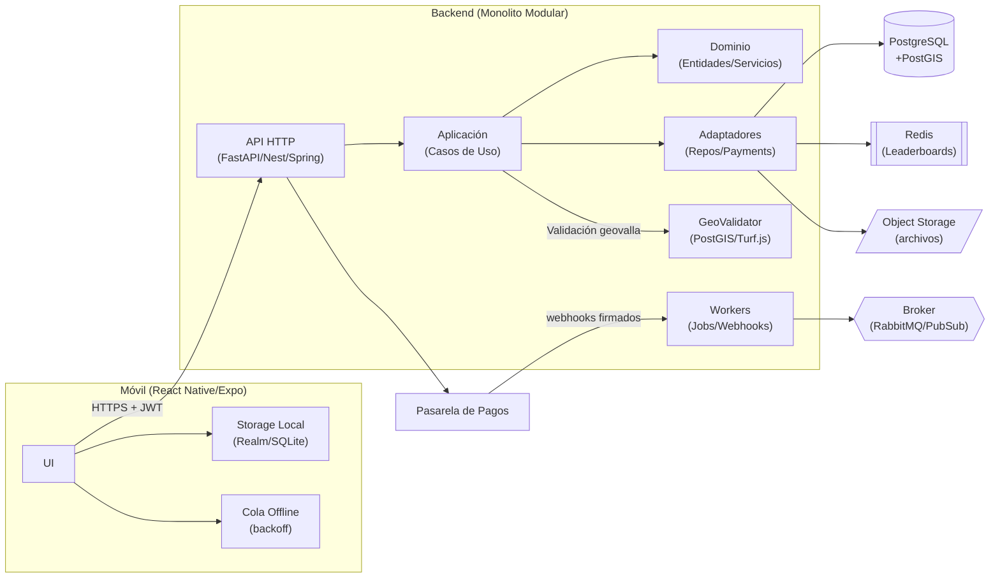

# APPMUNICIPALITY

# 🟢 Fase 1: Requisitos (Elicitación y Análisis)

## 🔹 Requisitos Funcionales
#### **Definen qué debe hacer el sistema, sin explicar cómo.**

- **RF-01:** El sistema debe permitir al usuario registrarse.  
- **RF-02:** El sistema debe permitir al usuario iniciar sesión.  
- **RF-03:** El sistema debe mostrar una pantalla de demo para nuevos usuarios.  
- **RF-04:** El usuario podrá descubrir actividades por municipio.  
- **RF-05:** El usuario podrá validar actividades mediante QR.  
- **RF-06:** El sistema debe mostrar el ranking por municipio.  
- **RF-07:** El sistema debe mostrar el ranking global.  
- **RF-08:** El sistema debe permitir a un administrador agregar o modificar actividades.  
- **RF-09:** El usuario podrá modificar contraseña, recuperar contraseña y eliminar cuenta.  
- **RF-10:** El sistema debe permitir consultar recomendaciones personalizadas.  
- **RF-11:** El sistema debe ofrecer un **período de prueba (Trial)** al registrarse.  
- **RF-12:** El sistema debe mostrar planes de suscripción, con opción de compra y pago.  
- **RF-13:** El sistema debe eliminar todas las relaciones de datos al borrar la cuenta.  
- **RF-14:** El sistema debe mostrar el historial/progreso del usuario.  

## 🔹 Requisitos No Funcionales
#### **Definen cómo debe comportarse el sistema en términos de calidad.**

- **RNF-01:** Latencia API p95 < 400 ms en lecturas y < 800 ms en escrituras.  
- **RNF-02:** Validación QR en < 2 segundos.  
- **RNF-03:** Inicio de la app en < 2.5 segundos.  
- **RNF-04:** Tamaño del paquete móvil ≤ 60 MB.  
- **RNF-05:** Disponibilidad mínima del sistema: 99.9% mensual.  
- **RNF-06:** Backups con RPO ≤ 15 min y RTO ≤ 1 h.  
- **RNF-07:** Operaciones críticas idempotentes (ej. pagos, validación).  
- **RNF-08:** Soporte offline con encolado de acciones.  
- **RNF-09:** Reintentos automáticos con exponential backoff.  
- **RNF-10:** Resolución de conflictos con last-write-wins.  
- **RNF-11:** Autenticación con JWT + refresh tokens rotativos.  
- **RNF-12:** Cifrado de datos sensibles (AES-256, TLS 1.2+).  
- **RNF-13:** Cumplimiento OWASP ASVS L2 y OWASP Top 10.  
- **RNF-14:** Eliminación total de datos en ≤ 72 h (GDPR-like).  
- **RNF-15:** Pagos seguros con verificación de firma en webhooks.  
- **RNF-16:** Accesibilidad según WCAG 2.2 AA.  
- **RNF-17:** Internacionalización ES/EN y formatos locales.  
- **RNF-18:** Escalabilidad hasta 1000 RPS con autoescalado.  
- **RNF-19:** Rankings con lecturas < 50 ms usando Redis.  
- **RNF-20:** Cobertura de pruebas ≥ 70% en módulos críticos.  
- **RNF-21:** Observabilidad con OpenTelemetry, logs y métricas.  
- **RNF-22:** Despliegues blue/green o canary con rollback ≤ 5 min.  
- **RNF-23:** Compatibilidad móvil: Android 10+ e iOS 14+.  
- **RNF-24:** Backend portable en Docker sobre Linux.  

---

# 🟡 Fase 2: Diseño

## 🔹 Casos de Uso
#### **Son la traducción técnica y detallada de un RF: describen actores, precondiciones, flujo principal y alternos.**

- **CU-01:** Iniciar sesión → Actor: Usuario. (RF-02)  
- **CU-02:** Registrar usuario → Actor: Usuario. (RF-01)  
- **CU-03:** Usar período de prueba (Trial) → Actor: Usuario. (RF-11)  
- **CU-04:** Validar reto con QR → Actor: Usuario. (RF-05)  
- **CU-05:** Consultar ranking global → Actor: Usuario. (RF-07)  
- **CU-06:** Consultar ranking municipal → Actor: Usuario. (RF-06)  
- **CU-07:** Gestionar actividades (CRUD) → Actor: Administrador. (RF-08)  
- **CU-08:** Comprar plan de suscripción → Actor: Usuario. (RF-12)  
- **CU-09:** Realizar pago → Actor: Usuario. (RF-12, RF-07)  
- **CU-10:** Eliminar cuenta (y todas sus relaciones) → Actor: Usuario. (RF-09, RF-13)  

## 🔹 Historias de Usuario
#### **Expresan la misma necesidad pero en lenguaje del usuario, centradas en el valor.**

- *Como usuario quiero registrarme para poder acceder a las actividades.* → **CU-02 / RF-01**  
- *Como usuario nuevo quiero tener un período de prueba (Trial) de 3 días para usar la app antes de pagar.* → **CU-03 / RF-11**  
- *Como usuario quiero escanear un QR para validar que cumplí una actividad.* → **CU-04 / RF-05**  
- *Como usuario quiero ver el ranking global y municipal para compararme con otros.* → **CU-05, CU-06 / RF-06, RF-07**  
- *Como usuario quiero comprar un plan y pagarlo en línea para seguir participando.* → **CU-08, CU-09 / RF-12**  
- *Como administrador quiero modificar actividades para mantener actualizado el contenido.* → **CU-07 / RF-08**  
- *Como usuario quiero eliminar mi cuenta y que se borren todas mis relaciones de datos.* → **CU-10 / RF-09, RF-13**  

## 🔹 Stack tecnologico

- **Mysql**
- **React Native**
- **Driver.js**
- **Python**
- **Redis**

## 🔹 C1 - Context
#### **¿Quién usa y con qué sistemas externos se conecta?**

## 🔹 C2 - Contenedores
#### **¿Qué apps (ejecutables) e infraestructura (BD, colas, storage) forman el sistema?**

WIP....

## 🔹 C3 - Componentes
#### **¿Qué partes internas tiene cada app?**

## 🔹 C4 - Código
#### **¿Qué clases, funciones e implementaciones tiene cada módulo?**