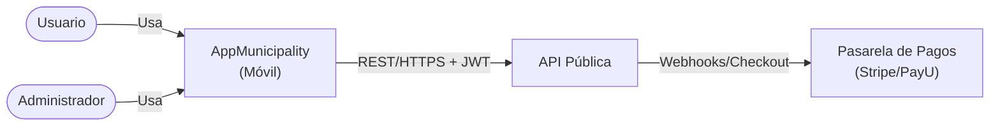

# APPMUNICIPALITY

# 🟢 Fase 1: Requisitos (Elicitación y Análisis)

## 🔹 Requisitos Funcionales
#### **Definen qué debe hacer el sistema, sin explicar cómo.**

### 1. Autenticación y Gestión de Cuenta
- **RF-01:** El sistema debe permitir al usuario registrarse.  
- **RF-02:** El sistema debe permitir al usuario iniciar sesión.  
- **RF-09:** El sistema debe permitir al usuario modificar contraseña, recuperar contraseña y eliminar su cuenta.  
- **RF-13:** El sistema debe eliminar todas las relaciones de datos al borrar la cuenta.  
- **RF-19:** El sistema debe permitir al usuario ver detalles de su perfil, plan actual, idioma.

### 2. Experiencia de Usuario
- **RF-03:** El sistema debe mostrar una pantalla de demo para nuevos usuarios.  
- **RF-04:** El sistema debe permitir al usuario descubrir actividades por municipio.  
- **RF-05:** El sistema debe permitir al usuario validar actividades mediante QR.  
- **RF-10:** El sistema debe permitir recibir recomendaciones sobre municipios.  
- **RF-14:** El sistema debe mostrar el historial/progreso del usuario.  
- **RF-16:** El sistema debe permitir al usuario descubrir municipios.  
- **RF-18:** El sistema debe permitir ver información del municipio.

### 3. Ranking y Gamificación
- **RF-06:** El sistema debe mostrar el ranking por municipio.  
- **RF-07:** El sistema debe mostrar el ranking global.  

### 4. Administración
- **RF-08:** El sistema debe permitir a un administrador agregar o modificar actividades.  
- **RF-15:** El sistema debe permitir a un administrador modificar roles de los usuarios.  
- **RF-17:** El sistema debe permitir a un administrador editar, agregar y eliminar municipios.  

### 5. Monetización
- **RF-11:** El sistema debe ofrecer un período de prueba (Trial) al registrarse.  
- **RF-12:** El sistema debe mostrar planes de suscripción, con opción de compra y pago.  
- **RF-20:** El sistema debe permitir renovar o cancelar plan.  
- **RF-21:** El sistema debe contar con historial de pagos por usuario.  

---

## 🔹 Requisitos No Funcionales
#### **Definen cómo debe comportarse el sistema en términos de calidad.**

### 1. Rendimiento
- **RNF-01:** Latencia API p95 < 400 ms en lecturas y < 800 ms en escrituras.  
- **RNF-02:** Validación QR en < 2 segundos.  
- **RNF-03:** Inicio de la app en < 2.5 segundos.  
- **RNF-19:** Rankings con lecturas < 50 ms usando Redis.  
- **RNF-18:** Escalabilidad hasta 1000 RPS con autoescalado.  

### 2. Disponibilidad y Resiliencia
- **RNF-05:** Disponibilidad mínima del sistema: 99.9% mensual.  
- **RNF-06:** Backups con RPO ≤ 15 min y RTO ≤ 1 h.  
- **RNF-07:** Operaciones críticas idempotentes (ej. pagos, validación).  
- **RNF-08:** Soporte offline con encolado de acciones.  
- **RNF-09:** Reintentos automáticos con exponential backoff.  
- **RNF-10:** Resolución de conflictos con last-write-wins.  
- **RNF-22:** Despliegues blue/green o canary con rollback ≤ 5 min.  

### 3. Seguridad y Privacidad
- **RNF-11:** Autenticación con JWT + refresh tokens rotativos.  
- **RNF-12:** Cifrado de datos sensibles (AES-256, TLS 1.2+).  
- **RNF-13:** Cumplimiento OWASP ASVS L2 y OWASP Top 10.  
- **RNF-14:** Eliminación total de datos en ≤ 72 h (GDPR-like).  
- **RNF-15:** Pagos seguros con verificación de firma en webhooks.  

### 4. Usabilidad y Experiencia
- **RNF-04:** Tamaño del paquete móvil ≤ 60 MB.  
- **RNF-16:** Accesibilidad según WCAG 2.2 AA.  
- **RNF-17:** Internacionalización ES/EN y formatos locales.  
- **RNF-23:** Compatibilidad móvil: Android 10+ e iOS 14+.  

### 5. Mantenibilidad y Calidad de Software
- **RNF-20:** Cobertura de pruebas ≥ 70% en módulos críticos.  
- **RNF-21:** Observabilidad con OpenTelemetry, logs y métricas.  
- **RNF-24:** Backend portable en Docker sobre Linux.  

---

# 🟡 Fase 2: Diseño y arquitectura

## 🔹 Casos de Uso
#### **Son la traducción técnica y detallada de un RF: describen actores, precondiciones, flujo principal y alternos.**

- **CU-01:** Iniciar sesión → Actor: Usuario. (RF-02)  
- **CU-02:** Registrar usuario → Actor: Usuario. (RF-01)  
- **CU-03:** Usar período de prueba (Trial) → Actor: Usuario. (RF-11)  
- **CU-04:** Validar reto con QR → Actor: Usuario. (RF-05)  
- **CU-05:** Consultar ranking global → Actor: Usuario. (RF-07)  
- **CU-06:** Consultar ranking municipal → Actor: Usuario. (RF-06)  
- **CU-07:** Gestionar actividades (CRUD) → Actor: Administrador. (RF-08)  
- **CU-08:** Comprar plan de suscripción → Actor: Usuario. (RF-12)  
- **CU-09:** Realizar pago → Actor: Usuario. (RF-12, RF-15)  
- **CU-10:** Eliminar cuenta (y todas sus relaciones) → Actor: Usuario. (RF-09, RF-13)  
- **CU-11:** Recuperar o modificar contraseña → Actor: Usuario. (RF-09)  
- **CU-12:** Consultar historial/progreso → Actor: Usuario. (RF-14)  
- **CU-13:** Recibir recomendaciones de municipios → Actor: Usuario. (RF-10)  
- **CU-14:** Gestionar municipios (CRUD) → Actor: Administrador. (RF-17)  
- **CU-15:** Modificar roles de usuarios → Actor: Administrador. (RF-15)  
- **CU-16:** Ver pantalla de demo inicial → Actor: Usuario. (RF-03)  
- **CU-17:** Descubrir municipios y actividades → Actor: Usuario. (RF-04, RF-16)  
- **CU-18:** Ver información del municipio → Actor: Usuario. (RF-18)  
- **CU-19:** Consultar perfil y plan actual → Actor: Usuario. (RF-19)  
- **CU-20:** Renovar o cancelar plan → Actor: Usuario. (RF-20)  
- **CU-21:** Consultar historial de pagos → Actor: Usuario. (RF-21)  

---

## 🔹 Historias de Usuario
#### **Expresan la misma necesidad pero en lenguaje del usuario, centradas en el valor.**

- *Como usuario quiero registrarme para poder acceder a las actividades.* → **CU-02 / RF-01**  
- *Como usuario quiero iniciar sesión para continuar con mi progreso.* → **CU-01 / RF-02**  
- *Como usuario nuevo quiero tener un período de prueba (Trial) de 3 días para usar la app antes de pagar.* → **CU-03 / RF-11**  
- *Como usuario quiero ver una pantalla de demo al iniciar para entender cómo funciona la app.* → **CU-16 / RF-03**  
- *Como usuario quiero descubrir municipios y actividades para decidir a dónde ir.* → **CU-17 / RF-04, RF-16**  
- *Como usuario quiero escanear un QR para validar que cumplí una actividad.* → **CU-04 / RF-05**  
- *Como usuario quiero ver el ranking global y municipal para compararme con otros.* → **CU-05, CU-06 / RF-06, RF-07**  
- *Como usuario quiero consultar mi historial/progreso para hacer seguimiento a lo que ya he hecho.* → **CU-12 / RF-14**  
- *Como usuario quiero recibir recomendaciones sobre municipios para descubrir nuevas experiencias.* → **CU-13 / RF-10**  
- *Como usuario quiero comprar un plan y pagarlo en línea para seguir participando.* → **CU-08, CU-09 / RF-12, RF-15**  
- *Como usuario quiero recuperar o modificar mi contraseña para mantener el acceso a la app.* → **CU-11 / RF-09**  
- *Como usuario quiero eliminar mi cuenta y que se borren todas mis relaciones de datos.* → **CU-10 / RF-09, RF-13**  
- *Como usuario quiero ver la información de un municipio para conocer qué ofrece.* → **CU-18 / RF-18**  
- *Como usuario quiero consultar mi perfil y el plan que tengo activo para saber mis beneficios.* → **CU-19 / RF-19**  
- *Como usuario quiero renovar o cancelar mi plan para seguir o dejar de usar la app.* → **CU-20 / RF-20**  
- *Como usuario quiero consultar mi historial de pagos para tener control sobre mis gastos.* → **CU-21 / RF-21**  
- *Como administrador quiero gestionar actividades (CRUD) para mantener actualizado el contenido.* → **CU-07 / RF-08**  
- *Como administrador quiero gestionar municipios (CRUD) para mantener la app alineada con la realidad.* → **CU-14 / RF-17**  
- *Como administrador quiero modificar roles de usuarios para controlar los permisos dentro de la app.* → **CU-15 / RF-15**  

## 🔹 Stack tecnologico

- **Mysql**
- **React Native**
- **Driver.js**
- **Python**
- **Redis**

## 🔹 C1 - Context
#### **¿Quién usa y con qué sistemas externos se conecta?**

## 🔹 C2 - Contenedores
#### **¿Qué apps (ejecutables) e infraestructura (BD, colas, storage) forman el sistema?**

## 🔹 C3 - Componentes
#### **¿Qué partes internas tiene cada app?**

## 🔹 C4 - Código
#### **¿Qué clases, funciones e implementaciones tiene cada módulo?**